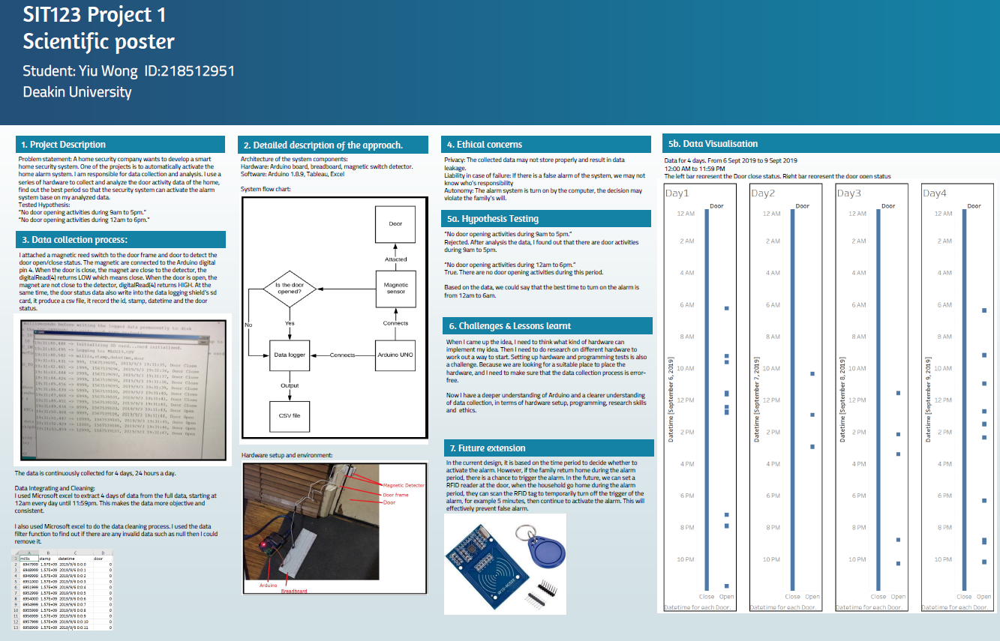

# Embedded home data collection system

Scenario: This project is to conduct data collection and analysis for a home security company that wants to develop a smart home security system. One of the functions is to automatically activate the home alarm system based on the collected data. This project involves a series of hardware to collect and analyze the door activity data of the home, find out the best period so that the security system can activate the alarm system base on the analyzed data.

